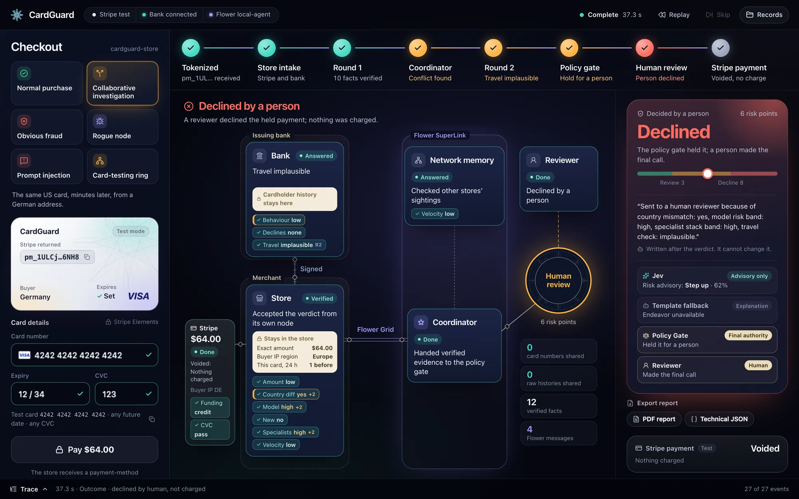
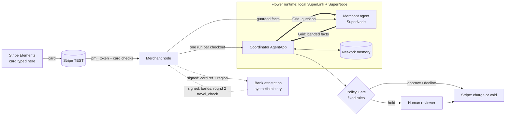
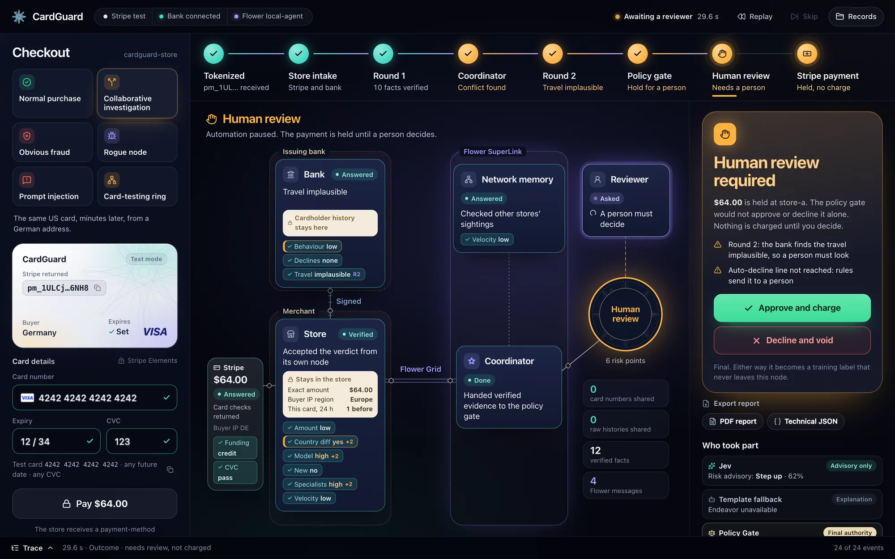
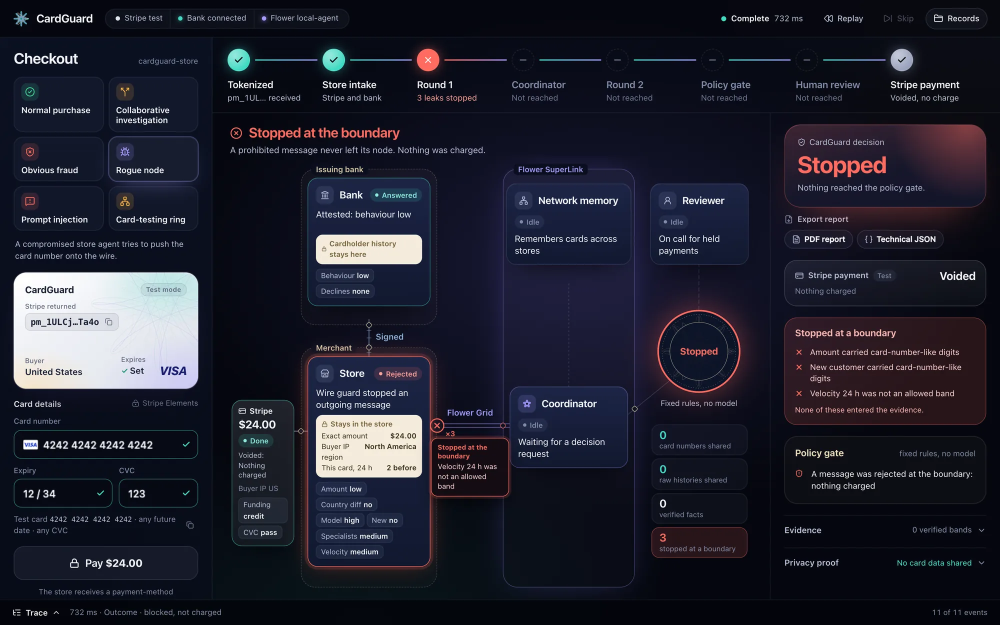

# CardGuard

**Merchants, a card's bank and a Flower coordinator investigate one card payment together, and card data never enters
any model's context.**

[](https://flower.ai) [](https://docs.stripe.com/testing) [](pyproject.toml) [](LICENSE)



A payment can look normal to one merchant. CardGuard lets independent parties (merchants, the card's bank, and a network
memory across stores) collaborate on fraud without pooling sensitive data. Stripe keeps the card, only banded facts
cross between parties, fixed rules in code make the decision, and a person decides the uncertain cases.

Built at the Flower Collaborative Agent Hackathon, Stanford, September 29 2026. Flower Hub app: `@ac007/cardguard`.

## Why CardGuard

- **Fraud is a network problem.** A card-testing ring looks like one ordinary purchase at each store it hits. Only a
  shared view sees the pattern.
- **Nobody may share the card that links the records.** CardGuard shares bands and one-word answers instead.
- **Models advise, code decides.** A deterministic Policy Gate makes every automated decision. Jev can only add
  caution; Flower Endeavor only explains.
- **People own the grey zone.** A held payment waits for an authenticated reviewer; nothing is charged until then.
- **Every decision can be checked.** A hash-chained ledger, a live trace, and exportable PDF and JSON reports.

## How it works



**Thick arrows** are Flower Grid messages: a `{purpose, decision_id}` question and a reply of banded facts, nothing
else. **Dotted arrows** are signed HTTP between the merchant and bank nodes, outside Flower. Round 2 is one extra Grid
question that the store's node relays to the bank. Details: [docs/ARCHITECTURE.md](docs/ARCHITECTURE.md).

## Demo

Each checkout moves along the step rail at the top of the UI, driven only by events the nodes report:

1. **Tokenized.** Stripe Elements sends the card to Stripe; the store receives a `pm_...` id.
2. **Store intake.** Stripe returns card checks; the bank attests two bands over a signed channel.
3. **Round 1.** The coordinator asks the store's SuperNode over Flower Grid and verifies every banded fact on arrival.
4. **Coordinator.** Network memory adds its band; a conflict between store and bank is flagged.
5. **Round 2, if needed.** One targeted question to the bank: is this travel plausible?
6. **Policy Gate.** Fixed rules score the facts: approve, hold for a person, or decline.
7. **Human review, if needed.** An authenticated reviewer approves or declines; the label trains that node's model.
8. **Stripe outcome.** A TEST PaymentIntent is confirmed, or the verification is voided and nothing is charged.

| Scenario | What happens |
|---|---|
| Normal purchase | Approved and charged; card numbers shared: 0 |
| Collaborative investigation | Store and bank disagree; round 2 asks the bank; held for a person |
| Obvious fraud | Stripe's CVC check fails: hard decline, no vote, nothing charged |
| Rogue node | A compromised merchant agent tries to leak the card; every attempt stops at the boundary |
| Prompt injection | A gift message tries to steer the model-driven agent; its draft is checked, never sent |
| Card-testing ring | One card at three stores in a minute: network band low, medium, high; the third is held |

<p>
  
  
</p>

Script, expected results and troubleshooting: [docs/DEMO.md](docs/DEMO.md).

## What judges can see

- A **real Stripe TEST payment** from Stripe Elements, charged or voided by the outcome.
- A **real Flower flow** on a local SuperLink and SuperNode, with its run id, SuperNode id and Grid messages in the
  trace and the report.
- **Privacy-safe evidence**: every fact that crossed a boundary, and the counters "card numbers shared: 0" and
  "raw histories shared: 0".
- A **targeted round 2**, asked only when the store's evidence conflicts with the bank's (or the bank could not answer).
- **Jev's advisory vote** and a **Flower Endeavor explanation** when they answer; the fallback is labelled when not.
- The **deterministic Policy Gate**, rule by rule, and **human review** for held payments.
- **Rogue-node rejection** at the wire guard.
- **Human-readable PDF reports** and **technical JSON audit reports** for any finished decision.

## Quick start

```bash
make demo          # bank + merchant nodes, decisions in-process
make demo-flower   # the same through a local Flower SuperLink + SuperNode
make test          # Python tests, then the web typecheck, lint, tests and build
```

Open **http://127.0.0.1:4242**. Needs Python 3.11 to 3.13, [uv](https://docs.astral.sh/uv/), pnpm and Stripe TEST keys
in `.env` (see [.env.example](.env.example)). Full setup: [docs/DEMO.md](docs/DEMO.md#setup).

## Privacy and safety

- **Stripe keeps the card.** The number, expiry and CVC go from Stripe Elements to Stripe; no PAN or CVC ever reaches
  React state, the merchant node, Flower or a model.
- **Closed-vocabulary evidence.** Only allow-listed bands cross a node boundary; a wire guard refuses and logs anything
  else, at the sender and again at the receiver.
- **Deterministic final authority.** The Policy Gate decides. Jev's vote can only make it more cautious; Endeavor
  only explains.
- **Authenticated human review.** Every human action needs the reviewer credential.
- **Private exports.** PDF and JSON reports run their own privacy scan before download.

Threat model, rogue-node and prompt-injection defences: [docs/SECURITY.md](docs/SECURITY.md).

## Real vs demo

| Real | Synthetic or demo-only |
|---|---|
| Stripe TEST mode payments, card checks and voids | The bank's private cardholder history |
| Flower AgentApp on a local SuperLink and SuperNode | The demo reviewer session (a local HttpOnly cookie) |
| Jev (TypeSafe) votes, when a key is configured | The one-click scenarios, buyer country and hour controls, and test fixtures |
| Flower Endeavor explanations, when the provider answers | One SuperNode fronting three stores |
| The event-driven React UI, and PDF and JSON reports | |

## Reports


Any finished decision exports as a **PDF** for people and a **JSON** record for machines, built from the same trace
the UI animates. The example below is the Collaborative investigation run on local Flower: round 2 found the travel
implausible, the gate held the payment, and a person declined it.

- [View example PDF report](docs/examples/cardguard-decision-example.pdf)
- [View example JSON report](docs/examples/cardguard-decision-example.json)

What a report contains and what the privacy scan refuses: [docs/REPORTING.md](docs/REPORTING.md).

<br clear="right">

## Tech

Python (Flask nodes, numpy models) · Flower 1.39 (AgentApp, Grid, ServerApp and ClientApp with FedAvg) · Stripe TEST ·
React, Vite, TypeScript and Motion · jsPDF · Jev (TypeSafe) · Flower Endeavor (`flwrlabs/endeavor-1.0`).

The fraud models are trained with Flower FedAvg on IEEE-CIS (590,540 real transactions, five merchants). FedAvg plus a
local fine-tune helped small merchants most; plain FedAvg does not beat large merchants on their own data
([docs/TRAINING.md](docs/TRAINING.md)).

## Team

| GitHub | Flower ID |
| --- | --- |
| [AskArtwentythree](https://github.com/AskArtwentythree) | - |
| [CR2004](https://github.com/CR2004) | `ac007` |
| [ksk-17](https://github.com/ksk-17) | `ksk1705` |
| [shin0343](https://github.com/shin0343) | `jshin` |
| [zsz13](https://github.com/zsz13) | `@zsz13` |

## Documentation

| Document | Covers |
|---|---|
| [docs/ARCHITECTURE.md](docs/ARCHITECTURE.md) | Parties, data flow, round 1 and round 2, Flower topology, bank attestation, Stripe |
| [docs/SECURITY.md](docs/SECURITY.md) | Threat model, privacy boundaries, prompt injection, rogue nodes, reviewer authorization |
| [docs/REPORTING.md](docs/REPORTING.md) | PDF and JSON reports, the report schema, the export privacy scan, the example |
| [docs/DEMO.md](docs/DEMO.md) | Setup, the demo script, expected results, troubleshooting |
| [docs/TRAINING.md](docs/TRAINING.md) | How the fraud models are trained with Flower, and measured results |

## Status and limitations

- **Validated locally:** Stripe TEST, the Flower AgentApp over a local SuperLink and SuperNode, Jev, and PDF and JSON
  exports. One decision also ran end to end on SuperGrid on September 29 (about 3 minutes, mostly task scheduling);
  it is not part of the demo path and was not re-validated for this release.
- **Endeavor can fall back.** When Flower's Endeavor provider errors or answers after 8 seconds, a template explains
  instead; the decision never depends on it.
- **Demo state is in memory.** Network memory, rate limits and each store's card history reset when the demo
  restarts; review labels and the review audit are kept in `.demo/`.
- **The bank's history is synthetic,** and its card reference is a keyed hash of Stripe's TEST card fingerprint: a
  demo correlation, not an issuer-network identity protocol.
- **Hand-set values:** the rule weights, band cutoffs and the instant-learning label share.

## License and data

MIT. IEEE-CIS data is used under the Kaggle competition rules for research and is not included in this repository.
