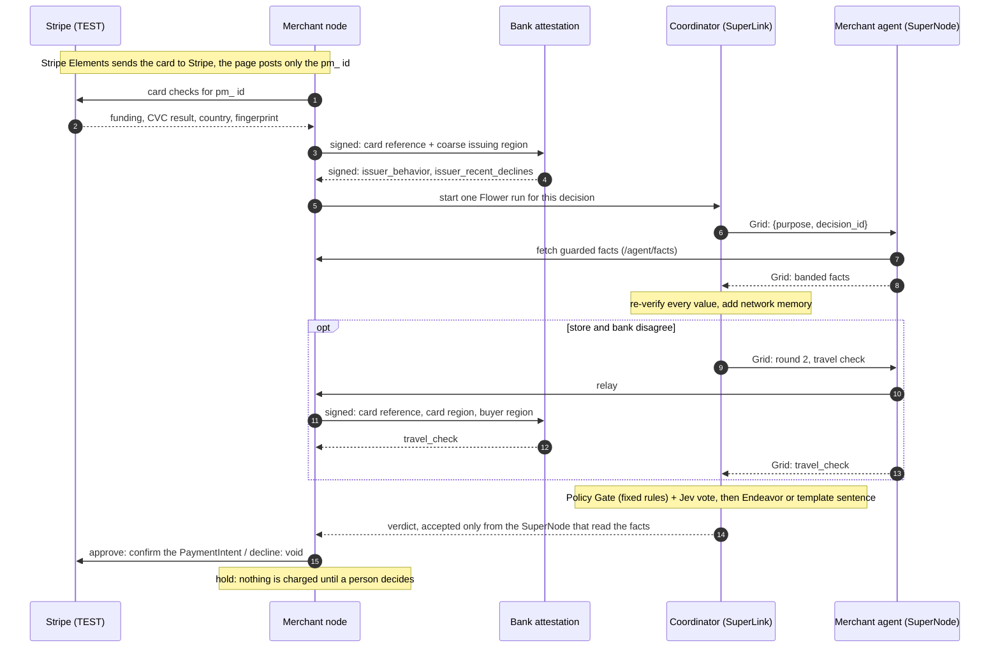

# CardGuard architecture

How one card payment is investigated by several parties, what each of them knows, and exactly what crosses between
them. The threat model is in [SECURITY.md](SECURITY.md); the exported decision record is in [REPORTING.md](REPORTING.md).

## The parties

| Party | Runs on | Knows privately | Shares |
|---|---|---|---|
| **Stripe** (TEST mode) | Stripe | The card number, expiry and CVC | A `pm_...` payment-method id and card checks (funding type, CVC result, card country, fingerprint) with the merchant node |
| **Merchant node** (one per merchant, several stores) | Its own process, `:4242` | Exact amount, buyer region, this card's history at the store, two fraud models' raw scores | Banded facts only, through its ledger and wire guard |
| **Merchant agent** | A Flower SuperNode beside the merchant node | Nothing of its own: it fetches the guarded facts from its node | The banded facts, as a Grid reply |
| **Bank attestation node** | Its own process, `:4243`, signed requests only | Synthetic cardholder history: last in-person city and time, recent declines | Two bands in round 1; one word in round 2 |
| **Coordinator agent** | A Flower AgentApp on the SuperLink | Only the bands it received | The verdict |
| **Network memory** | The coordinator's state, kept across Flower runs | Which card reference each store saw in the last 10 minutes | One band: `network_velocity_band` |
| **Policy Gate** | Code, no model | Nothing | The decision: approve, hold for a person, or decline |
| **Human reviewer** | The merchant's review panel, authenticated | Their judgement | A label that never leaves the node |
| **Jev** (TypeSafe) | Called by the coordinator | Banded facts only | A vote, which can only add caution |
| **Endeavor** (Flower-served model) | Called by the coordinator through the Flower runtime | The verdict and its recognised reasons only | One sentence of explanation for people |

## One payment, step by step

1. **Card entry.** Stripe Elements (Stripe's own iframes) sends the card to Stripe. The store posts only the
   payment-method id.
2. **Stripe lookup.** The merchant asks Stripe for the card checks. Attaching the method to a customer runs the CVC
   check without charging anything. Stripe's card fingerprint becomes a letters-only card reference (a keyed hash,
   `tok_` plus 16 letters) and never leaves the Stripe adapter.
3. **Bank attestation, round 1.** Over a signed channel the merchant sends the card reference and the card's coarse
   issuing region. The bank answers `issuer_behavior` and `issuer_recent_declines`. It never sees a card and never
   moves money.
4. **Banded facts and the wire guard.** The merchant computes its facts, scores two fraud models locally, and discloses
   through a ledger that allows one disclosure per decision, limits disclosures per card, and refuses unknown keys,
   off-vocabulary values, long strings and card-like digit runs.
5. **Agents on Flower.** The merchant starts a Flower run. The coordinator AgentApp on the SuperLink sends the merchant's
   SuperNode a purpose-tagged question over Grid. The merchant agent fetches the guarded facts from its own node and
   replies. The coordinator re-verifies the reply and adds the network memory's band.
6. **Round 2, only on disagreement.** If the store sees a buyer abroad while the card checks pass and the bank sees an
   ordinary cardholder, the coordinator asks one targeted question through the same node: is this travel plausible?
   The bank answers `travel_check` from history it never shares. "Implausible" holds the payment for a person and never
   declines by itself; no answer also holds it. Round 2 is also asked when a configured bank did not answer round 1,
   and skipped when the rules already decline.
7. **Decision.** Fixed rules score the facts. A failed CVC is a hard decline with no vote. Jev's vote can make the
   decision more cautious, never less, and an approval Jev is less than 80% sure of goes to a person. Endeavor writes
   one sentence of explanation, or a template does if the model does not answer within 8 seconds.
8. **Outcome.** Approve confirms a Stripe TEST PaymentIntent. Decline voids the pending verification. Both are final.
   A hold waits for an authenticated person, whose decision becomes a training label that updates the fraud model on
   that node inside the same request ([TRAINING.md](TRAINING.md#human-feedback-the-model-learns-at-once)).

Code drives every Grid call. No model chooses a tool, sees a Grid payload, or decides alone.

## What crosses each link

Nothing else crosses. Every value on the wire is from a closed vocabulary and passes the wire guard (unknown keys,
off-vocabulary values, long strings and card-like digit runs are refused and logged).

| Link (channel on screen) | What is sent | What is never sent |
|---|---|---|
| Buyer to **Stripe** (Stripe Elements) | Card number, expiry, CVC | Nothing reaches the store or any node |
| **Stripe** to **Store** (Stripe) | A `pm_...` payment-method id; card checks: funding type, CVC result, card country, a fingerprint | The card number. The fingerprint never leaves the Stripe adapter: it becomes a letters-only card reference (`tok_` + 16 letters) |
| **Store** to **Bank**, round 1 (Signed) | The card reference and the card's coarse issuing region (e.g. "North America") | Amount, buyer, city, anything about the card itself. Requests are signed per merchant |
| **Bank** to **Store**, round 1 (Signed) | `issuer_behavior` low/medium/high/unknown, `issuer_recent_declines` none/some/many/unknown | The history behind them |
| **Coordinator** to **Store's SuperNode** (Flower Grid) | A question: `{purpose, decision_id}` | Nothing else exists on the Grid |
| **Store's SuperNode** to **Coordinator** (Flower Grid) | The card reference plus banded facts: `amount_band` (relative to this store's own order sizes), `country_mismatch`, `card_funding`, `cvc_check`, `velocity_band`, `new_customer`, `model_risk_band` (federated model), `specialist_stack_band` (four specialist models), and the bank's two bands | Exact amount, country, hour, card history, raw model scores, the four individual specialist bands |
| **Coordinator** and **Network memory** (state) | Card reference, store identity, time | Anything about the card or the purchase. Out comes one band: `network_velocity_band` low/medium/high |
| Round 2: **Coordinator** to **Store** to **Bank** (Flower Grid, then Signed) | One question: is travel plausible? The bank gets the card reference, the card's region and the buyer's region | The buyer's country or city |
| Round 2 answer | `travel_check` plausible/implausible/unknown | The bank's reason |
| **Coordinator** to **Policy Gate** (code) | The verified facts | Nothing leaves the coordinator |
| Models | **Jev** (TypeSafe) votes on the banded facts only; **Endeavor** (via Flower) writes one sentence from the verdict and recognised cites only (which can include `travel_check=implausible`) | Neither sees a card reference, a card or a Grid payload; Jev never sees `travel_check` |
| **Gate** to **Reviewer** (review) | The held payment's evidence and the gate's reasons | Card data: the reviewer sees bands too |

## Flower

- **AgentApp, two roles.** The coordinator role runs on the SuperLink and drives the Grid tools in code: `get_nodes`,
  `push_messages`, `pull_messages`. The merchant role runs on each SuperNode and answers with `push_reply_message`.
  Each checkout is one Flower run, started through the SuperLink Control API with the decision as the prompt
  (`cardguard/agentapp/launch.py`).
- **Two message shapes only.** The question `{purpose, decision_id}` and the reply `{purpose, decision_id, facts}` or
  `{error}`. Both pass a value scan and a size cap before sending; the coordinator re-guards every reply.
- **Run series as agent memory.** Consecutive runs share a Flower run series, so the network memory persists in
  `context.state`. That is how a card seen at three stores becomes a fact no single store could produce. The merchant
  accepts a verdict only after the run reports completed.
- **Identity from Flower.** A verdict is accepted only from the SuperNode that read the facts, two replies to one
  decision go to a person, and network sightings are keyed by Flower's authenticated node id.
- **Where it runs.** The demo uses a local SuperLink and SuperNode (`make demo-flower`), which is what the example
  report was generated on. One decision also ran end to end on SuperGrid on Sep 29 (federation `@ac007/cardguard`,
  about 3 minutes, mostly task scheduling); that path is not part of the local demo and was not re-run for this
  document. One SuperNode fronts three stores in the demo; in production each merchant would run its own.
- **Fallback.** If no Flower verdict arrives in time, the merchant node decides in its own process with the same rules
  and the trace says so.
- **Endeavor.** The coordinator calls `flwrlabs/endeavor-1.0` through the Flower runtime for the explanation sentence.
  When the provider errors or answers too slowly, a template answers and the decision is unaffected.
- **Federated training.** The shipped fraud model is trained with a Flower ServerApp and ClientApp, one simulated
  SuperNode per merchant, with FedAvg; FedMedian and differential privacy are available. See [TRAINING.md](TRAINING.md).

## Stripe

Stripe is the only payment rail and the one hard dependency: without TEST keys there is no payment and no mock mode.
Live keys are refused, and only the publishable key reaches the browser. The merchant holds a `pm_...` id and never
logs it; the ledger never holds the id, a card number or a verification id. Stripe's own fraud tools decide with what
Stripe sees; CardGuard adds what Stripe does not see (the merchant's history, the bank's view of its cardholder,
sightings across merchants) and runs beside the processor, not instead of it.

## Bank attestation

The bank node attests; it never processes a payment and never sees a card. It knows a card only by the pseudonymous card
reference plus the card's coarse issuing region. Its history is **synthetic**: the first time it is asked about a card
it creates one, which then ages with the clock. This is a demo correlation over Stripe TEST data, not an issuer-network
identity protocol. Without the bank node its facts are `unknown` and no round 2 is asked.

## Repository layout

| Path | What it is |
|---|---|
| `cardguard/agentapp/` | The Flower AgentApp (coordinator and merchant roles), the run launcher, the dispute agent |
| `cardguard/decision/` | Wire guard and ledger, coordinator rules and verifier, network memory, Endeavor explanation, hash-chained audit |
| `cardguard/payment_processing/` | The merchant node, Stripe TEST processor, review store, live investigation trace, the model-driven demo agent |
| `cardguard/bank/` | The bank attestation node and its signed client |
| `cardguard/training/`, `cardguard/specialists/` | Federated learning, human-label retraining, differential privacy; the four signal-family models |
| `cardguard/data/` | IEEE-CIS loading and features |
| `web/` | The investigation UI (React, Vite, TypeScript) and the report export (`web/src/report/`) |
| `tests/` | Offline tests: Stripe, Jev, Endeavor and the model client are faked; the bank runs in-process |

Built by the CardGuard team at the Flower Collaborative Agent Hackathon; see [Team](../README.md#team).
