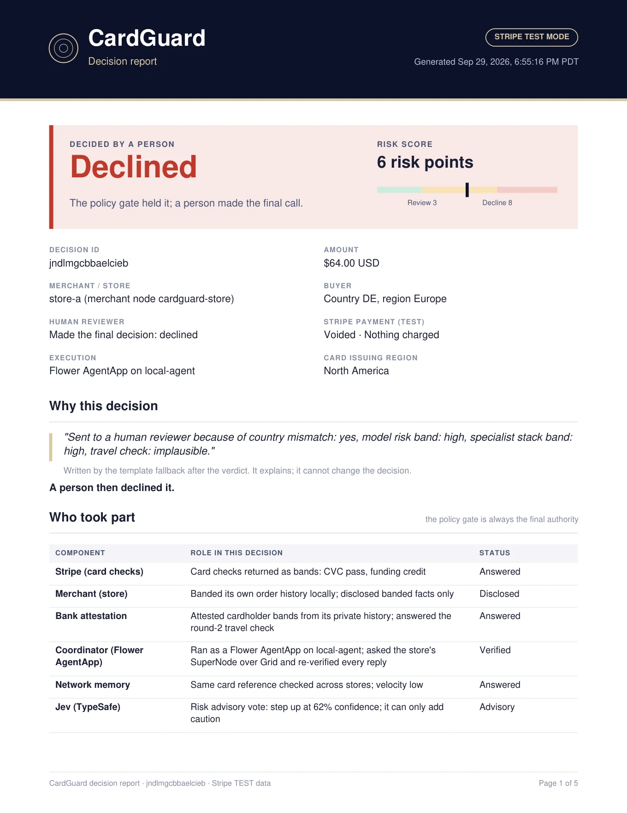
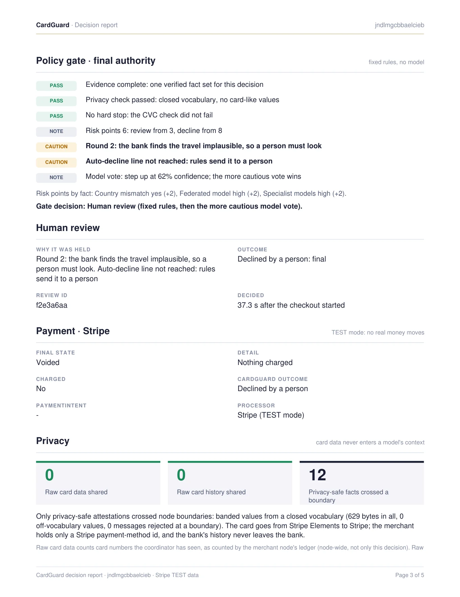

# Decision reports

Every finished investigation can be exported from the UI in two forms, from the **Export report** row under the
decision:

- **PDF report**: a readable decision record for reviewers, auditors and judges.
- **Technical JSON**: the full privacy-safe record, including the trace, for machines.

The export is offered once the checkout reached an outcome: a final verdict, a stop before the gate, or a payment held for
review (so a held decision can be exported before a person decides). It is never offered between the gate and Stripe's
answer.

**Example, generated by the real application:**
[PDF report](examples/cardguard-decision-example.pdf) ·
[JSON report](examples/cardguard-decision-example.json)

  
  

## One source, two views

Both files are built in the browser (`web/src/report/`) from what the page already holds: the events returned by
`GET /trace/<id>`, which the page animates, and the view derived from them. Nothing is invented: a section exists only
when an event says it happened. The PDF is drawn from the scrubbed JSON object, so it can never contain anything the
JSON does not. The PDF renderer (jsPDF) is loaded only when someone exports.

| File | Role |
|---|---|
| `web/src/report/report.ts` | `buildReport()`: the report object, the privacy scan, `reportReady()` |
| `web/src/report/pdf.ts` | `renderPdf()`: the paginated PDF, drawn from the report object |
| `web/src/components/ExportReport.tsx` | The two export buttons and their status line |
| `web/src/report/report.test.ts` | Scenario, privacy, PDF and pagination tests |

## The PDF

A header with the decision id, Stripe mode and generation time, then:

1. **Verdict**: the final decision, who made it, the risk score against the review and decline lines, and a summary
   (amount, store, buyer country and region, card issuing region, execution mode, Stripe state).
2. **Why this decision**: the explanation sentence and who wrote it (Flower Endeavor, or the template fallback).
3. **Who took part**: every component and its role in this decision: Stripe card checks, the merchant, the bank,
   the Flower coordinator, network memory, Jev, the Policy Gate and the human reviewer.
4. **Round 1** and, when it happened, **Round 2**: the question, the trigger, the facts each party contributed.
5. **Policy gate**: every rule line with PASS, NOTE, CAUTION or FAIL, and the risk points by fact.
6. **Rejected at a boundary** (when something was blocked), **Human review**, **Payment · Stripe**.
7. **Privacy**: card data shared, raw history shared, privacy-safe facts that crossed, bytes, rejected messages.
8. **Flower execution** and a **technical appendix**: the run id, SuperNodes, Grid messages, and the trace step by step.

## The JSON

Pretty-printed, `report_version` `1.0`. Top-level fields:

| Field | Contents |
|---|---|
| `decision_id`, `created_at`, `checkout_sent_at` | The page's letters-only trace id and timestamps |
| `environment` | Merchant id, vertical, Stripe mode, demo controls, bank attestation, federation |
| `transaction` | Amount, store, buyer country (demo controls only), coarse buyer and card regions, attack mode |
| `verdict` | Final decision and label, who decided, gate decision, risk score and thresholds, hard stop, explanation |
| `participants` | Component, role and status for every party that took part |
| `execution` | Flower or in-process, run id, SuperNodes, Grid messages, verdict binding, fallback, and each round |
| `evidence` | Every banded fact with its party, round, status and risk points; per-party levels |
| `models` | Jev (voted, unavailable, not configured, or not reached: no gate, or a hard stop) and Endeavor (explained, template with reason, not reached) |
| `policy_gate` | Rules, the ones that fired, contributions by fact, or why the gate was not reached |
| `human_review` | Whether required, review id, status, decision, timing |
| `payment` | Stripe state and note, status, whether charged, PaymentIntent id, outcome |
| `security` | Card data and raw history counts with their basis, bytes, off-vocabulary values, rejected messages, redacted trace steps, export redactions |
| `trace` | The trace events, minus the card reference and each party's private readings |

## Privacy scan

The node already leak-scans the trace before serving it. The export adds its own last line of defence, so a regression
upstream cannot leak through a report:

- The trace drops the card reference and each step's private readings; only the coarse buyer and card regions are
  kept (the bank already receives both).
- Every string in the report is scanned before download and replaced with `[redacted]` if it holds a Luhn-valid 13 to 19
  digit run, a Stripe key (`sk_`, `rk_`, `pk_`), a Stripe object id or secret (`pm_`, `seti_`, `whsec_`), a full card
  reference, an expiry-like date, a CVC-like value, or any value the page holds privately (the Stripe payment-method id
  and the reviewer credential). Each redaction is listed by JSON path in `security.export_redactions`.
- SuperLink ids are digits by shape, so digit strings under their own keys (`run_id`, `node`, `nodes`, `supernodes`)
  are exempt from the card-number check, exactly as on the node; a Luhn-valid digit run under any other key is refused.
- The Stripe PaymentIntent id of an approved charge is kept on purpose, as the payment's reference; it is useless
  without the secret key, which never reaches the page.

The main guarantee is the design: the page never holds card numbers, CVC, expiry, secret keys, the raw Stripe
fingerprint or any party's private history, and the trace it exports from is scanned on the node. The export scan is a
backstop in case an upstream check regresses.

## The example

The committed example is the **Collaborative investigation** scenario, run on a local Flower SuperLink and SuperNode
(`make demo-flower`) with Stripe TEST keys: the same US test card, minutes after a normal purchase, from a German
address. The store saw a foreign buyer while the bank saw an ordinary cardholder, so the coordinator asked round 2; the
bank answered `travel_check = implausible`; the gate held the payment (6 risk points, review from 3); a person declined
it; Stripe voided the verification and nothing was charged. Jev voted `step_up` at 62% confidence (advisory). Flower's
Endeavor provider was returning errors at the time, so the explanation is the template fallback, and the report says so.

Before committing, both files were scanned for card numbers, CVC, expiry, keys and credentials, Stripe ids and
fingerprints, the bank's private history, local paths, email addresses and IP addresses; nothing was found. The
demo's own labels and review audit were redirected to a scratch directory for the run.
